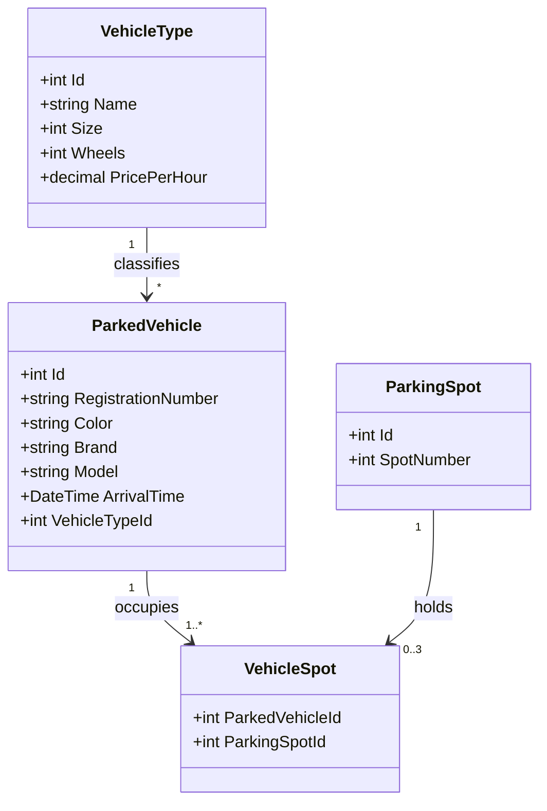

# Garage 2.0 — Database & Parking Logic Design

A design document for the extended Garage exercise: fixed parking spots, vehicles of
different sizes, motorcycle sharing (⅓ spot each), statistics, and a dropdown that only
offers vehicle types that can actually be parked right now.

---

## 1. Class Diagram



**Key idea:** the relationship between vehicles and spots is *many-to-many* via the
`VehicleSpot` junction table.

- A **truck** (2 spots) → 2 rows in `VehicleSpot`.
- A **boat/airplane** (3 spots) → 3 rows.
- A **motorcycle** (⅓ spot) → 1 row, and up to 3 motorcycles may share the same spot.

`Size` is measured in **thirds of a spot** so all math stays in integers:

| Type       | Size (thirds) | Spots occupied |
|------------|---------------|----------------|
| Motorcycle | 1             | ⅓              |
| Car        | 3             | 1              |
| Bus        | 6             | 2              |
| Truck      | 6             | 2              |
| Boat       | 9             | 3              |
| Airplane   | 9             | 3              |

---

## 2. Entity Classes (EF Core)

```csharp
public class VehicleType
{
    public int Id { get; set; }
    public string Name { get; set; } = "";
    public int Size { get; set; }            // in thirds of a spot
    public int Wheels { get; set; }
    public decimal PricePerHour { get; set; }

    public ICollection<ParkedVehicle> Vehicles { get; set; } = new List<ParkedVehicle>();
}

public class ParkedVehicle
{
    public int Id { get; set; }
    public string RegistrationNumber { get; set; } = "";
    public string Color { get; set; } = "";
    public string Brand { get; set; } = "";
    public string Model { get; set; } = "";
    public DateTime ArrivalTime { get; set; }

    public int VehicleTypeId { get; set; }
    public VehicleType VehicleType { get; set; } = null!;

    public ICollection<VehicleSpot> Spots { get; set; } = new List<VehicleSpot>();
}

public class ParkingSpot
{
    public int Id { get; set; }
    public int SpotNumber { get; set; }      // 1..N

    public ICollection<VehicleSpot> Vehicles { get; set; } = new List<VehicleSpot>();
}

public class VehicleSpot   // junction table
{
    public int ParkedVehicleId { get; set; }
    public ParkedVehicle ParkedVehicle { get; set; } = null!;

    public int ParkingSpotId { get; set; }
    public ParkingSpot ParkingSpot { get; set; } = null!;
}
```

### DbContext configuration

```csharp
public class GarageContext : DbContext
{
    public DbSet<VehicleType> VehicleTypes => Set<VehicleType>();
    public DbSet<ParkedVehicle> ParkedVehicles => Set<ParkedVehicle>();
    public DbSet<ParkingSpot> ParkingSpots => Set<ParkingSpot>();
    public DbSet<VehicleSpot> VehicleSpots => Set<VehicleSpot>();

    protected override void OnModelCreating(ModelBuilder b)
    {
        b.Entity<VehicleSpot>()
            .HasKey(vs => new { vs.ParkedVehicleId, vs.ParkingSpotId });

        b.Entity<ParkedVehicle>()
            .HasIndex(v => v.RegistrationNumber)
            .IsUnique();

        b.Entity<ParkingSpot>()
            .HasIndex(s => s.SpotNumber)
            .IsUnique();

        // Seed vehicle types
        b.Entity<VehicleType>().HasData(
            new VehicleType { Id = 1, Name = "Motorcycle", Size = 1, Wheels = 2, PricePerHour = 10 },
            new VehicleType { Id = 2, Name = "Car",        Size = 3, Wheels = 4, PricePerHour = 20 },
            new VehicleType { Id = 3, Name = "Bus",        Size = 6, Wheels = 6, PricePerHour = 40 },
            new VehicleType { Id = 4, Name = "Truck",      Size = 6, Wheels = 8, PricePerHour = 40 },
            new VehicleType { Id = 5, Name = "Boat",       Size = 9, Wheels = 0, PricePerHour = 60 },
            new VehicleType { Id = 6, Name = "Airplane",   Size = 9, Wheels = 3, PricePerHour = 60 });

        // Seed 20 spots
        b.Entity<ParkingSpot>().HasData(
            Enumerable.Range(1, 20)
                      .Select(n => new ParkingSpot { Id = n, SpotNumber = n }));
    }
}
```

---

## 3. Core Parking Logic

### Spot occupancy model

Every spot has a capacity of **3 thirds**:

- **Free** — no vehicles. Anything may park (subject to contiguity for big vehicles).
- **Partially free** — holds 1–2 motorcycles. Only motorcycles may join.
- **Full** — holds a non-motorcycle vehicle, or 3 motorcycles.

```csharp
public record SpotStatus(ParkingSpot Spot, int MotorcycleCount, bool HasBigVehicle)
{
    public bool IsFree          => MotorcycleCount == 0 && !HasBigVehicle;
    public bool AcceptsMc       => !HasBigVehicle && MotorcycleCount < 3;
    public int  ThirdsAvailable => HasBigVehicle ? 0 : 3 - MotorcycleCount;
}

private async Task<List<SpotStatus>> GetSpotStatusesAsync()
{
    return await _context.ParkingSpots
        .OrderBy(s => s.SpotNumber)
        .Select(s => new SpotStatus(
            s,
            s.Vehicles.Count(vs => vs.ParkedVehicle.VehicleType.Name == "Motorcycle"),
            s.Vehicles.Any(vs => vs.ParkedVehicle.VehicleType.Name != "Motorcycle")))
        .ToListAsync();
}
```

### Assigning spots when parking

```csharp
public async Task<List<ParkingSpot>?> FindSpotsForAsync(VehicleType type)
{
    var statuses = await GetSpotStatusesAsync();

    // Motorcycle: fill an already-started spot first
    if (type.Size == 1)
    {
        var shared = statuses.FirstOrDefault(s => s.AcceptsMc && s.MotorcycleCount > 0)
                  ?? statuses.FirstOrDefault(s => s.IsFree);
        return shared is null ? null : new List<ParkingSpot> { shared.Spot };
    }

    // Car / truck / boat: need N *consecutive* fully free spots
    int spotsNeeded = type.Size / 3;
    var run = new List<ParkingSpot>();

    foreach (var s in statuses)
    {
        if (s.IsFree)
        {
            // reset the run if spot numbers are not consecutive
            if (run.Count > 0 && s.Spot.SpotNumber != run[^1].SpotNumber + 1)
                run.Clear();

            run.Add(s.Spot);
            if (run.Count == spotsNeeded)
                return run;
        }
        else
        {
            run.Clear();
        }
    }
    return null;   // no room → this type should be greyed out in the dropdown
}
```

### Parking and checkout

```csharp
public async Task<bool> ParkAsync(ParkedVehicle vehicle)
{
    var spots = await FindSpotsForAsync(vehicle.VehicleType);
    if (spots is null) return false;

    vehicle.ArrivalTime = DateTime.Now;
    foreach (var spot in spots)
        vehicle.Spots.Add(new VehicleSpot { ParkingSpot = spot });

    _context.ParkedVehicles.Add(vehicle);
    await _context.SaveChangesAsync();
    return true;
}

public async Task<Receipt?> CheckOutAsync(string regNr)
{
    var vehicle = await _context.ParkedVehicles
        .Include(v => v.VehicleType)
        .Include(v => v.Spots).ThenInclude(vs => vs.ParkingSpot)
        .FirstOrDefaultAsync(v => v.RegistrationNumber == regNr);

    if (vehicle is null) return null;

    var duration = DateTime.Now - vehicle.ArrivalTime;
    var price = (decimal)duration.TotalHours * vehicle.VehicleType.PricePerHour;
    var spotNumbers = vehicle.Spots.Select(vs => vs.ParkingSpot.SpotNumber).ToList();

    _context.ParkedVehicles.Remove(vehicle);   // cascade deletes VehicleSpot rows
    await _context.SaveChangesAsync();

    return new Receipt(regNr, vehicle.ArrivalTime, duration, price, spotNumbers);
}

public record Receipt(string RegNr, DateTime Arrival, TimeSpan Duration,
                      decimal Price, List<int> SpotNumbers);
```

### Statistics

```csharp
public async Task<StatisticsViewModel> GetStatisticsAsync()
{
    var vehicles = await _context.ParkedVehicles
        .Include(v => v.VehicleType)
        .ToListAsync();

    var now = DateTime.Now;
    return new StatisticsViewModel
    {
        CountPerType = vehicles
            .GroupBy(v => v.VehicleType.Name)
            .ToDictionary(g => g.Key, g => g.Count()),

        TotalWheels = vehicles.Sum(v => v.VehicleType.Wheels),

        RevenueSoFar = vehicles.Sum(v =>
            (decimal)(now - v.ArrivalTime).TotalHours * v.VehicleType.PricePerHour)
    };
}
```

### Dropdown with unavailable types greyed out

```csharp
public async Task<List<SelectListItem>> GetTypeOptionsAsync()
{
    var types = await _context.VehicleTypes.ToListAsync();
    var options = new List<SelectListItem>();

    foreach (var type in types)
    {
        bool canPark = await FindSpotsForAsync(type) is not null;
        options.Add(new SelectListItem
        {
            Value = type.Id.ToString(),
            Text = type.Name,
            Disabled = !canPark        // renders as a greyed-out <option>
        });
    }
    return options;
}
```

---

## 4. How It All Works — Walkthrough

**Landing page.** The controller calls `GetSpotStatusesAsync()` and sums
`ThirdsAvailable` across all spots. Displayed as e.g. *“12 ⅔ spots free of 20.”*
Fully free vs. partially free counts can be shown separately.

**Parking a car.** The dropdown only enables types that fit. On submit,
`FindSpotsForAsync` returns the lowest-numbered free spot, one `VehicleSpot` row is
written, and the receipt view shows the spot number.

**Parking a truck.** `FindSpotsForAsync` scans spots in order looking for a run of
2 consecutive free spots (the run resets on any gap or occupied spot). Two junction
rows are written — the truck “remembers” both spots.

**Parking motorcycles.** The first motorcycle takes a free spot. The second one finds
that spot via the *“accepts motorcycles and already has at least one”* rule and joins
it. The fourth motorcycle starts a new spot. This satisfies the assignment’s
*“fill the same spot until full”* requirement automatically.

**Checkout.** The vehicle row is deleted; cascade delete removes its junction rows,
which instantly frees its spot(s) for the next arrival. Price = hours parked × the
type’s hourly rate, computed on the fly — nothing stored, so it can never go stale.

**Overview of spots.** Iterate `GetSpotStatusesAsync()` and render each spot as
free / partial (1–2 motorcycles) / full, e.g. as a colored grid. Because the data
comes from the junction table, this view can never disagree with reality.

### Why this design

- **Integers only.** Sizes in thirds (1, 3, 6, 9) avoid floating-point fractions entirely.
- **One source of truth.** Occupancy, free counts, statistics, and the dropdown are all
  *derived* from `VehicleSpot` rows — no counters to keep in sync.
- **Constraints in the database.** The composite key prevents duplicate assignments;
  the unique index on `RegistrationNumber` prevents double parking of the same vehicle.
- **Ready for Garage 3.0.** The extra entities (`VehicleType`, `ParkingSpot`) are exactly
  what the next exercise introduces, so nothing needs to be redesigned later.