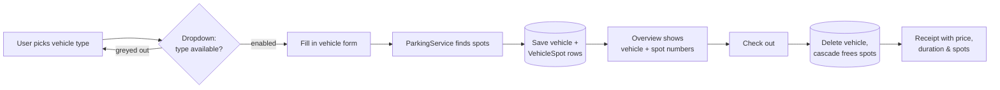
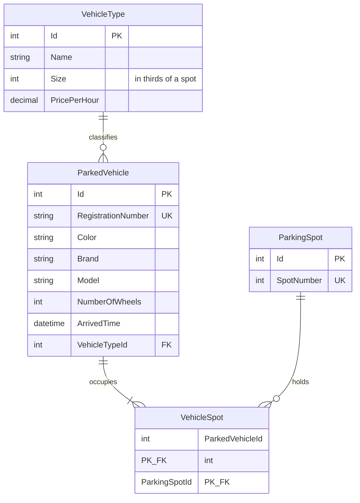
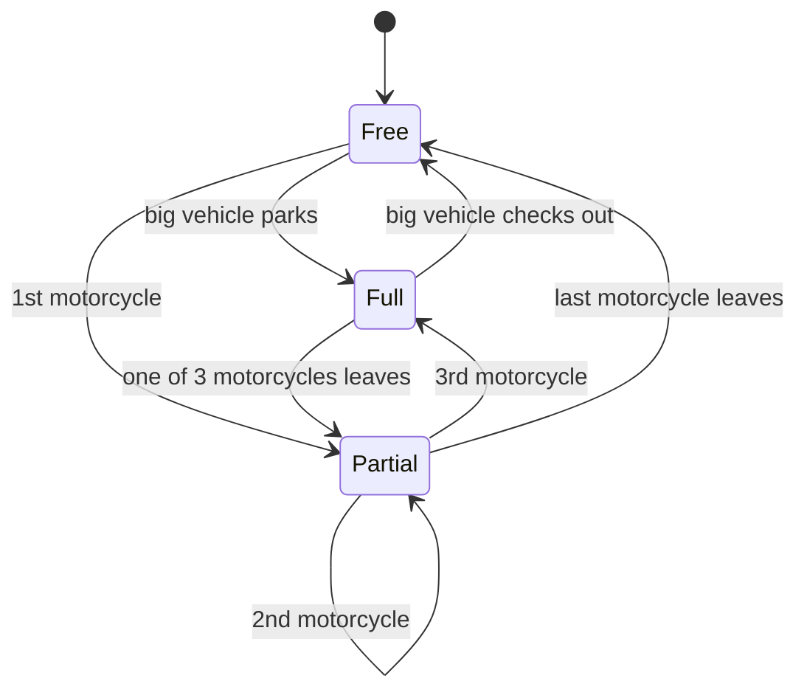
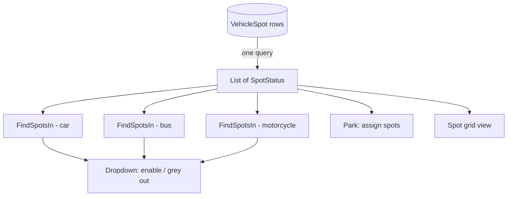

# Garage 2.0 — Parking Spots Design (README)

How we add **fixed parking spots**, **vehicle sizes**, **motorcycle sharing (⅓ spot)**,
**statistics**, and a **smart dropdown** to the Garage — with `VehicleType` as a database
table instead of an enum.

---

## 1. The big picture



Everything — occupancy, statistics, the dropdown — is **derived from one table**
(`VehicleSpot`). No counters to keep in sync, nothing that can disagree with reality.

---

## 2. Why VehicleType becomes a table (not an enum)

| | Enum + switch-statements | **Table (this design)** |
|---|---|---|
| Size & price live in… | Code (two parallel switches) | One DB row per type |
| Add a new type | Code change + rebuild | `INSERT` one row |
| Change a price | Redeploy | Update one value |
| Enum reorder bug risk | Yes (stored ints shift) | None |
| Dropdown source | `Enum.GetValues` | The table itself |
| Garage 3.0 ready | No — redesign needed | Yes — same shape |

## 3. Data model



**Key idea:** vehicle ↔ spot is *many-to-many* through `VehicleSpot`:

- A car (1 spot) → **1 row**
- A bus (2 spots) → **2 rows**
- A boat (3 spots) → **3 rows**
- A motorcycle (⅓ spot) → **1 row**, and up to **3 motorcycles share one spot**

### Sizes in thirds — integer math only

| Type | Size (thirds) | Spots | Price/hour |
|---|---|---|---|
| Motorcycle | 1 | ⅓ | 10 kr |
| Car | 3 | 1 | 20 kr |
| Bus | 6 | 2 | 40 kr |
| Truck | 6 | 2 | 40 kr |
| Boat | 9 | 3 | 60 kr |

Every spot has capacity **3 thirds**. No floats, no rounding surprises.

### Spot occupancy at a glance

```text
Spot:      1     2     3     4     5     6     7
        ┌─────┬─────┬─────┬─────┬─────┬─────┬─────┐
        │ CAR │ MC  │     │ BUS───BUS │ MC  │     │
        │     │ MC  │     │           │     │     │
        │     │     │     │           │     │     │
        └─────┴─────┴─────┴─────┴─────┴─────┴─────┘
Status:  FULL  PART  FREE  FULL  FULL  PART  FREE
Thirds:  0/3   1/3   3/3   0/3   0/3   2/3   3/3   free
```

A spot is in exactly one of three states:



---

## 4. Entity classes

```csharp
public class VehicleType
{
    public int Id { get; set; }
    public string Name { get; set; } = "";
    public int Size { get; set; }              // in thirds of a spot
    public decimal PricePerHour { get; set; }

    public ICollection<ParkedVehicle> Vehicles { get; set; } = new List<ParkedVehicle>();
}

public class ParkingSpot
{
    public int Id { get; set; }
    public int SpotNumber { get; set; }        // 1..N

    public ICollection<VehicleSpot> Vehicles { get; set; } = new List<VehicleSpot>();
}

public class VehicleSpot                        // junction table
{
    public int ParkedVehicleId { get; set; }
    public ParkedVehicle ParkedVehicle { get; set; } = null!;

    public int ParkingSpotId { get; set; }
    public ParkingSpot ParkingSpot { get; set; } = null!;
}
```

`ParkedVehicle` changes: the `VehicleType` enum property is replaced by
`int VehicleTypeId` + navigation, and it gains
`ICollection<VehicleSpot> Spots`. (`NumberOfWheels` stays on the vehicle —
a specific car knows its own wheels.)

### DbContext configuration

```csharp
protected override void OnModelCreating(ModelBuilder b)
{
    b.Entity<VehicleSpot>()
        .HasKey(vs => new { vs.ParkedVehicleId, vs.ParkingSpotId });

    b.Entity<ParkedVehicle>()
        .HasIndex(v => v.RegistrationNumber).IsUnique();

    b.Entity<ParkingSpot>()
        .HasIndex(s => s.SpotNumber).IsUnique();

    b.Entity<VehicleType>().HasData(
        new VehicleType { Id = 1, Name = "Motorcycle", Size = 1, PricePerHour = 10 },
        new VehicleType { Id = 2, Name = "Car",        Size = 3, PricePerHour = 20 },
        new VehicleType { Id = 3, Name = "Bus",        Size = 6, PricePerHour = 40 },
        new VehicleType { Id = 4, Name = "Truck",      Size = 6, PricePerHour = 40 },
        new VehicleType { Id = 5, Name = "Boat",       Size = 9, PricePerHour = 60 });

    b.Entity<ParkingSpot>().HasData(
        Enumerable.Range(1, 20).Select(n => new ParkingSpot { Id = n, SpotNumber = n }));
}
```

---

## 5. Parking logic — one DB read, pure logic after

The design's most important rule: **read spot statuses from the DB once**, then run all
decisions as pure in-memory functions. This makes the logic unit-testable without a
database and keeps the dropdown from firing one query per vehicle type.



```csharp
public record SpotStatus(ParkingSpot Spot, int MotorcycleCount, bool HasBigVehicle)
{
    public bool IsFree    => MotorcycleCount == 0 && !HasBigVehicle;
    public bool AcceptsMc => !HasBigVehicle && MotorcycleCount < 3;
    public int  ThirdsAvailable => HasBigVehicle ? 0 : 3 - MotorcycleCount;
}

// The ONLY database call in the whole flow
public async Task<List<SpotStatus>> GetSpotStatusesAsync() =>
    await _context.ParkingSpots
        .OrderBy(s => s.SpotNumber)
        .Select(s => new SpotStatus(
            s,
            s.Vehicles.Count(vs => vs.ParkedVehicle.VehicleType.Size == 1),
            s.Vehicles.Any(vs => vs.ParkedVehicle.VehicleType.Size > 1)))
        .ToListAsync();

// Pure function: no DbContext, trivially unit-testable
public static List<ParkingSpot>? FindSpotsIn(List<SpotStatus> statuses, VehicleType type)
{
    if (type.Size == 1)   // motorcycle: join a started spot first
    {
        var spot = statuses.FirstOrDefault(s => s.AcceptsMc && s.MotorcycleCount > 0)
                ?? statuses.FirstOrDefault(s => s.IsFree);
        return spot is null ? null : [spot.Spot];
    }

    int needed = type.Size / 3;   // simplest rule: any N free spots
    var free = statuses.Where(s => s.IsFree).Take(needed).Select(s => s.Spot).ToList();
    return free.Count == needed ? free : null;
}
```

> **Bonus (optional):** if the requirement demands *consecutive* spots for big
> vehicles, swap the two `free`-lines for the run-scanning loop. Do it as a separate
> commit — the simple version above already fulfils "a bus takes 2 spots".

### Motorcycle sharing, automatically

```text
Park MC #1  →  takes free spot 3        (spot 3: 1/3 used, PARTIAL)
Park MC #2  →  joins spot 3             (spot 3: 2/3 used, PARTIAL)
Park MC #3  →  joins spot 3             (spot 3: FULL)
Park MC #4  →  takes next free spot 7   (spot 7: 1/3 used)
```

The rule "prefer a partially-filled spot" gives the assignment's
*fill the same spot until full* behaviour with zero extra code.

---
