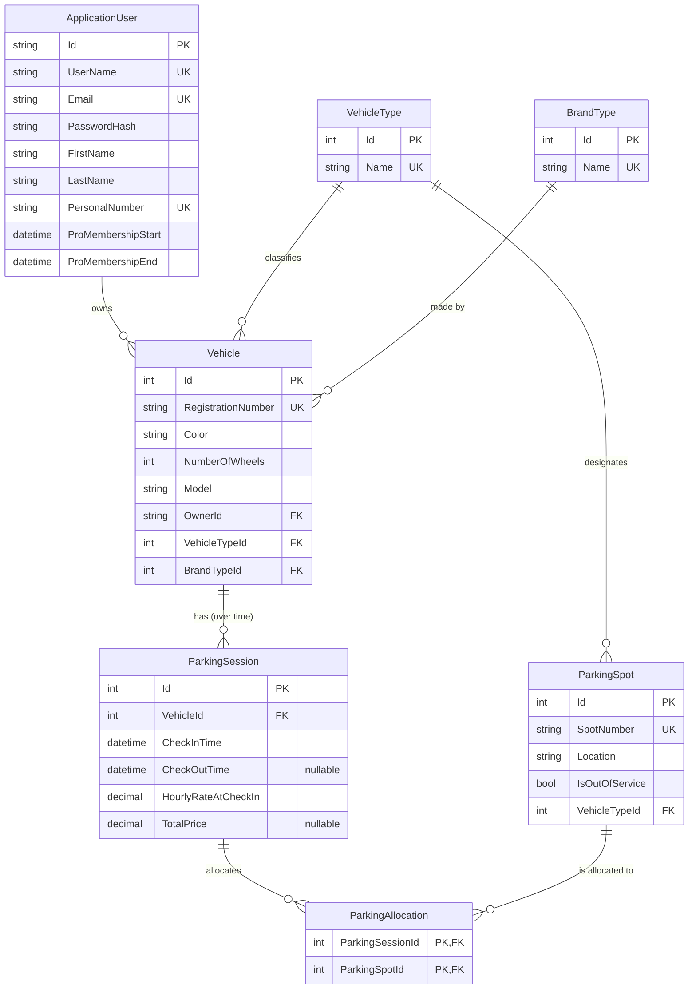

# ER-diagram – Garage

```mermaid
erDiagram
    ApplicationUser ||--o{ Vehicle : owns
    VehicleType ||--o{ Vehicle : classifies
    VehicleType ||--o{ ParkingSpot : designates
    BrandType ||--o{ Vehicle : "made by"
    Vehicle ||--o{ ParkingSession : "has (over time)"
    ParkingSession ||--o{ ParkingAllocation : allocates
    ParkingSpot ||--o{ ParkingAllocation : "is allocated to"

    ApplicationUser {
        string Id PK
        string UserName UK
        string Email UK
        string PasswordHash
        string FirstName
        string LastName
        string PersonalNumber UK
        datetime ProMembershipStart
        datetime ProMembershipEnd
    }

    VehicleType {
        int Id PK
        string Name UK
    }

    BrandType {
        int Id PK
        string Name UK
    }

    Vehicle {
        int Id PK
        string RegistrationNumber UK
        string Color
        int NumberOfWheels
        string Model
        string OwnerId FK
        int VehicleTypeId FK
        int BrandTypeId FK
    }

    ParkingSpot {
        int Id PK
        string SpotNumber UK
        string Location
        bool IsOutOfService
        int VehicleTypeId FK
    }

    ParkingSession {
        int Id PK
        int VehicleId FK
        datetime CheckInTime
        datetime CheckOutTime "nullable"
        decimal HourlyRateAtCheckIn
        decimal TotalPrice "nullable"
    }

    ParkingAllocation {
        int ParkingSessionId PK,FK
        int ParkingSpotId PK,FK
    }
```
